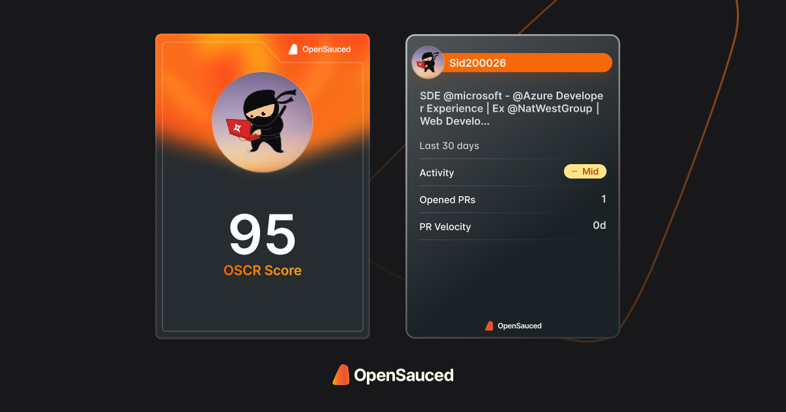

# Hey! 👋

You made it! Welcome to **my GitHub** — where code meets chaos, and projects sometimes work on the first try. 🤘

I'm a **React Native** and **Frontend Developer**, smashing bugs and building slick mobile and web apps. You could call it a superpower, but I just call it **Monday**.

## Wait, TWO GitHub accounts?! 🤯

Yeah, that's right — I roll with two accounts because why not?

1. **This one** is where you'll find my personal projects, mad experiments, and stuff I'm proud of (and some things I’m not, but hey, it's all part of the journey, right?).
   
2. [**The other one**](https://github.com/daveclintonn) is strictly for **open-source** shenanigans. That's where I contribute to the greater good. Check it out if you're into that sort of thing. 🎉

## Wanna Know More? 🌍

I'm not just lurking on GitHub. You can also hit up my [personal website](https://daveclintonn.cc/) — it's like my digital lair. Projects, blogs, and a sprinkle of randomness await. 

Now go forth, explore, and may your `npm install` never fail! 🍻

  

<h3 align="left">Connect with me:</h3>

 
